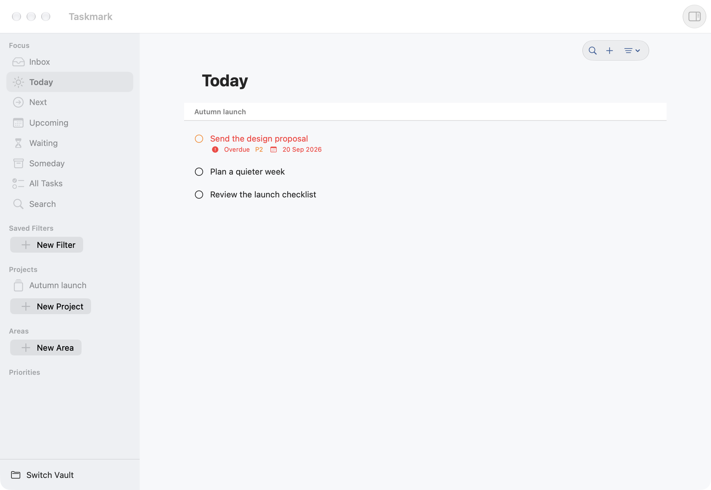

<p align="center">
  
</p>

<h1 align="center">Taskmark</h1>

<p align="center">
  A native, local-first task manager for macOS, backed by plain Markdown.
</p>

<p align="center">
  <a href="https://github.com/domness/taskmark/releases/latest"></a>
  <a href="https://github.com/domness/taskmark/actions/workflows/quality.yml"></a>
  <a href="LICENSE"></a>
  
</p>

<p align="center">
  
</p>

Taskmark combines a focused macOS app, a scriptable CLI, and a transparent file format. Tasks, projects, and areas remain readable and editable without Taskmark; the app and CLI share the same validation, recurrence, query, and storage code.

## Download

Download the latest signed and notarized universal build from [GitHub Releases](https://github.com/domness/taskmark/releases/latest). Taskmark requires macOS 15 or newer and supports Apple Silicon and Intel Macs.

1. Open the DMG, or extract the ZIP.
2. Move **Taskmark.app** to **Applications**.
3. Open Taskmark and create an empty vault or select an existing Taskmark vault.

Release downloads include SHA-256 checksums. Taskmark does not provide a sync service; use your preferred file synchronization tool and include the vault's hidden `.config/` directory.

## Highlights

- Fast Inbox, Today, Next, Upcoming, Waiting, Someday, search, and saved-filter workflows.
- Fixed and after-completion recurrence, paired-date rescheduling, and interactive Markdown checklists.
- Projects, areas, tags, priorities, custom task ordering, and multiple independent vault windows.
- Rendered Markdown titles and notes with source editing when needed.
- Autosave, native Undo/Redo, external-change refresh, conflict handling, and malformed-file diagnostics.
- Six adaptive native themes, bundled typography, and optional per-vault style tokens.
- A bundled `taskmark` CLI with human-readable and stable JSON output.
- No canonical database, account, analytics service, or cloud dependency.

See [Daily Workflows](docs/DAILY_WORK.md) for app controls and shortcuts, and [Personalization](docs/PERSONALIZATION.md) for ordering, themes, and task actions.

## Markdown Vaults

A vault is any directory with a schema 2 manifest:

```text
My Tasks/
  .config/
    config.yml       required vault manifest and shared preferences
    filters.md       optional saved filters
    style.css        optional native appearance overrides
  Tasks/
    Review launch.md
  Projects/
    Taskmark.md
  Areas/
    Work.md
```

Each entity is a Markdown file with YAML frontmatter. Exact, case-sensitive, vault-relative paths are entity identity; Taskmark does not add hidden UUIDs. Unknown frontmatter and Markdown bodies are preserved during known-field edits.

The [File Format](docs/FILE_FORMAT.md) is the canonical contract. Taskmark was previously named Local Todo, but there is no `localtodo` command or compatibility alias. The earlier development-only `.localtodo` layout is unsupported and has no migration.

## Command Line

Move Taskmark to Applications, then enable **Taskmark → Settings → General → Command-line interface**. After approving the native administrator prompt, open a new terminal:

```bash
taskmark --help
taskmark list --vault "$HOME/Taskmark" --view today
taskmark add --vault "$HOME/Taskmark" \
  "Tasks/Review launch.md" --title "Review launch" --status next --priority p1
taskmark doctor --vault "$HOME/Taskmark" --json
```

Taskmark registers `/usr/local/bin/taskmark` as a symlink to the bundled CLI. It does not edit shell profiles, replace unrelated files, or require the app to remain open. Commands resolve the nearest ancestor vault by default; use `--vault PATH` explicitly when needed, `--json` for automation, and `--dry-run` to preview mutations.

The CLI supports vault initialization; task add/show/edit/complete/reopen/reschedule/move; combined list/search queries; saved filters; project and area lifecycle commands; schema inspection; and diagnostics. Project and area path moves remain disabled until multi-file reference updates can satisfy the documented recovery contract.

## Agent Skills

- [taskmark](skills/taskmark/SKILL.md) manages vaults through the CLI with validation and dry runs.
- [taskmark-vault](skills/taskmark-vault/SKILL.md) documents safe direct-file work when the CLI is unavailable.
- [taskmark-release](skills/taskmark-release/SKILL.md) documents the repository's signed release process.

Install a skill by copying its complete directory, including any `references/` folder, into the agent's skills location.

## Documentation

| Guide | Purpose |
| --- | --- |
| [Daily Workflows](docs/DAILY_WORK.md) | App behavior and keyboard shortcuts |
| [Settings](docs/SETTINGS.md) | Vault preferences and CLI registration |
| [Themes](docs/THEMES.md) | Built-in palettes and style tokens |
| [File Format](docs/FILE_FORMAT.md) | Canonical vault and entity contract |
| [Architecture](docs/ARCHITECTURE.md) | Targets, dependency direction, and storage safety |
| [Roadmap](docs/ROADMAP.md) | Implemented work, validation gaps, and planned platforms |
| [CI and Releases](docs/CI_RELEASES.md) | Validation, signing, notarization, and packaging |

## Build From Source

Development requires Xcode with Swift 6 support, XcodeGen, SwiftFormat, SwiftLint, and Python 3.

```bash
git clone https://github.com/domness/taskmark.git
cd taskmark
make bootstrap
make check
open LocalTodo.xcodeproj
```

Run the `LocalTodoApp` scheme to build **Taskmark.app**. The internal `LocalTodo*` module names and bundle identifier intentionally remain stable. `make check` regenerates the project, checks formatting and lint, validates release scripts, runs package and app tests, and builds the Debug app.

## Contributing

Bug reports, focused feature proposals, documentation improvements, and code contributions are welcome. Read [CONTRIBUTING.md](CONTRIBUTING.md) before opening a pull request. Report security issues privately as described in [SECURITY.md](SECURITY.md).

## License

Taskmark is available under the [MIT License](LICENSE). Third-party palette and font notices are in [THIRD_PARTY_NOTICES.md](THIRD_PARTY_NOTICES.md). The Taskmark name and app icon identify this project; the MIT license does not grant trademark rights.
