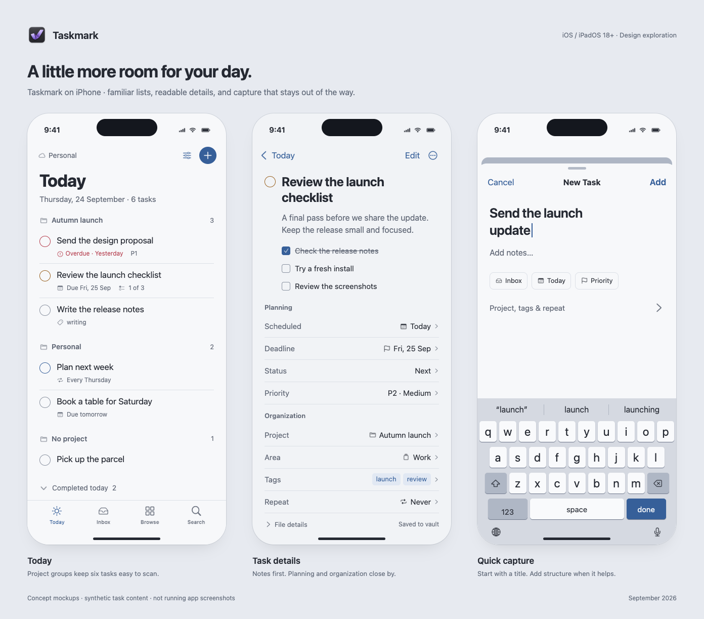
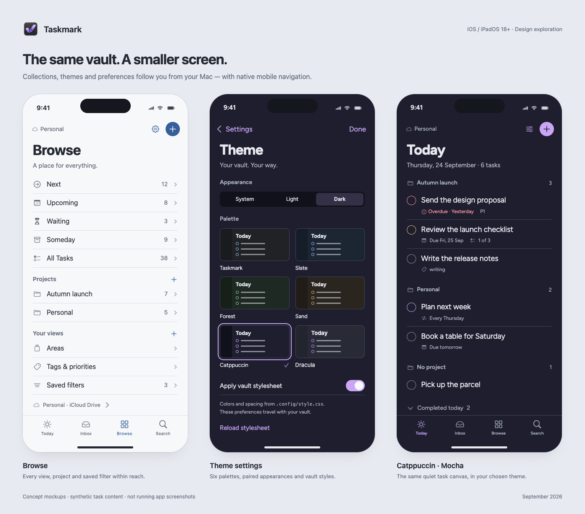
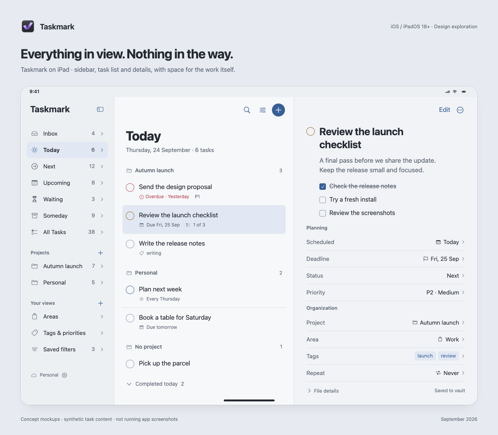

# Taskmark Mobile Mockups

Rendered screen concepts for iPhone and iPad, based on the [iOS specification](../../IOS_SPEC.md). Sample tasks are illustrative. These are design images, not screenshots of a working app.

[Download all ten PNGs as a ZIP](taskmark-ios-mockups.zip)

## Daily workflows

Today, task details and quick capture in Taskmark's light appearance.

## Browse and personalization

Browse, shared theme settings and Today in Catppuccin Mocha.

## iPad workspace

Navigation, task list and selected-task details in a regular-width layout.

## Individual iPhone images

Each image is exported at 786×1704 pixels (2× a 393×852-point composition).

| Screen | PNG |
| --- | --- |
| Today · Taskmark light | [Open image](images/today.png) |
| Task details | [Open image](images/detail.png) |
| Quick capture | [Open image](images/capture.png) |
| Browse | [Open image](images/browse.png) |
| Theme settings | [Open image](images/themes.png) |
| Today · Catppuccin Mocha | [Open image](images/today-dark.png) |
| Vault status · waiting files and conflict | [Open image](images/vault.png) |

[Source, design rationale and reproduction](README.md)
